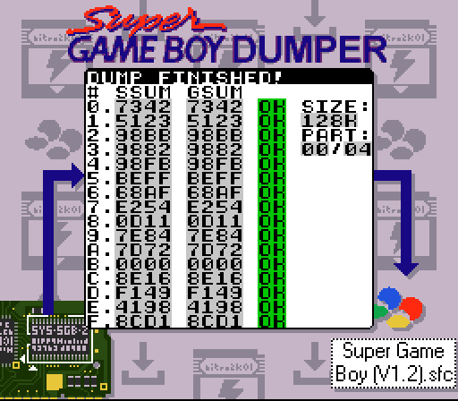

# Universal SGB dumper

Universal SGB dumper is a tool for dumping the SNES firmware from a Super Gameboy using a Gameboy cartridge. This is an idea that was suggested by PinoBatch for allowing users to easily and legally create a dump of their own SGB cartridge for use in emulators, pursuant to 17 USC 117 and foreign counterparts. I'm however personally more interested in exploring a new technique which I believe no one has really tried before. Other people, including in one game released in the commercial era of the SNES, Space Invaders, have explored running code on the SNES through the SGB. But no one as far as I know have done bulk transfer of many kilobytes of data from the SNES to the GB side. Maybe, in part, because it's mostly useless outside of this very use case. :)

The ROM works by uploading code from the Gameboy to the SNES using the `DATA_SND` command and then jumping to it using the `JUMP` command, which are both provided by the SGB. Then it's using the data port, normally used for sending the current joypad state to the game, to exfiltrate the contents of the cartridge and save them in some location specified by the user. The challenge with this project was to come up with a transfer protocol that was both fast enough to be practical, but also reliable, which I did in the end. 

There are still some opportunities to optimize the speed of the transfer, but with a transfer speed of about 22 seconds for a 128 kB file, which would have to be repeated one more time to get the full 256 kB, the SNES->GB transfer speed is not a major bottleneck in my opinion.

Right now, only SRAM is supported as a target, but the name universal was chosen because I also want to offer other ways to dump the ROM over time, like saving the ROM to the flash memory of a flash cartridge to allow it to be dumped in a single run, or maybe modulated through audio or even video where a GB Interceptor or some other video capture device could be used to extract the data.

This readme file also contains my development notes which might be helpful if you too want to develop software that uploads itself to the SNES and runs, or if you're just a masochist who likes reading technical documentation. :)

## Building

Prerequisites: some recent version of RGBDS, as well `ca65` and `ld65` from the cc65 package for building the SNES payload. A compiled binary of the SNES payload is included for convenience in case you have RGBDS installed but not cc65. RGBDS has a habit of breaking the syntax between versions. If the project doesn't assemble, try using version 0.6.1, which is the version used during the development of this project.

Under Linux and presumably macOS, just run `./m.sh`. Under Windows, run `m.bat`. In the Windows batch files, set `rgbenv` and `cc65env` to point to the respective tools, assuming they're not present in the path. No Makefile, sorry. Maybe one day.

## Download

If you are just looking for the ROM, go to [releases](https://github.com/nitro2k01/sgb-dumper/releases/).

## Usage

### Requirements

To use (the current version of) the SGB Dumper, you need a cartridge with battery backed SRAM. (Or the equivalent FRAM.) For the best experience, use a cartridge with 128 kB of RAM, but 8, 32, 64 and 128 kB can all be used. The SGB ROM is 256 kB big, meaning you need to run the SGB Dumper twice, and save the data after each run. For a cartridge with less SRAM, you just need to run the SGB Dumper more times and save the cartridge's SRAM after each run.

### Basic usage

Put the ROM on a flashcart and run it. When you run it, it will show some information about your SGB, or tell you that no SGB was detected. Use down/up to move in the menu, right/left to change settings, and start to start the dumping process. Set the SRAM size that's available on your cartridge, then run the program multiple times for each part that's listed for that SRAM size. For example, if you set the SRAM size to 32 kB, you need to dump 8 parts, 0 to 7. The length will always be 1 more than the index of the last part, in case you're unfamiliar with zero-based indexing.

You then need to take the save files you've dumped and concatenate them into a single file which should hopefully correspond to a good dump of the SGB firmware. You can for example merge the files using commands in your operating system. 

On Linux or other UNIX-ey systems, you can merge them with a command like below, which `cat`s the partial files and pipes them to the destination.

```
cat part0.sav part1.sav part2.sav part3.sav > sgb.smc
```

On Windows, you can use the copy command with the `/b` switch for binary, and the `+` operator to concatenate files.

```
copy /b part0.sav + part1.sav + part2.sav + part3.sav sgb.smc
```

However, I'm also offering a web based file merger which is really a modified version of [Marc Robledo's SGB Injector](https://github.com/marcrobledo/super-game-boy-border-injector/) since my web dev skills are not really up to date. You cannot run this locally by just opening the HTML file in a web browser, as most browsers will block Javascript from working for local files for security reasons. I'm hosting a copy [here](https://gg8.se/sgb-merger) that you can use. Other options include uploading the files to your own web server, or running a local server using Python.

For the last option, `cd` into the `sgb-file-merger` directory, then run the command:

```
python -m http.server
```

When that is running, you can navigate to `http://127.0.0.1:8000` in your web browser to access the file merger. This method of course assumes you have Python 3.x installed on your system.

### Detailed documentation


Below is a more detailed description of the information and options shown in the menu, and while dumping data, if you want to read it out of curiosity or for troubleshooting.

#### Boot (SGB boot ROM)

Possible values: **No SGB, SGB1, SGB2.** 

This compares the initial state of the GB CPU registers to known reference values for SGB1 and SGB2, and if neither match, shows "no SGB". Note however that "no SGB" is not a failure state here. In bsnes, the CPU registers match that of a DMG, but the SGB is still emulated correctly. It would also show "no SGB" on real hardware if you run it on a SGB modded to have a DMG CPU. However, in that case you'd need something to send the commands to wake up the SGB, which the SGB boot ROM would normally be responsible for.

#### MLTREQ (trivial SGB detection)

Possible values: **N(o), Y(es)** 

This attempts to detect SGB functionality the "traditional" way, by sending a MLT_REQ packet to enable multiplayer support and see if there's a SGB to respond. This is a basic test of communication with the SGB. A real SGB will typically show yes (see caveat below) whereas any Gameboy that's not a SGB will show no. Emulators with (HLE or LLE) SGB support will also show yes. If the test fails, the ROM halts execution with an error message.

Caveat: a flashcart with a menu ROM that presents itself as not compatible with SGB will permanently lock out SGB functionality, until the next SNES reset/power cycle. This will make the MLT_REQ test, and thus all subsequent tests and dumper functionality, fail. This can for example happen with an EZ Flash Jr, since it has trouble working with the SGB. For the EZFJr in particular, you can use my [SGB Enabler](https://blog.gg8.se/wordpress/2021/08/19/nitro2k01s-sgb-enabler-for-ez-flash-jr/) to solve the issue.

#### ACE (arbitrary code execution)

Possible values: **N(o), Y(es)** 

This attempts to upload the SNES payload, run it, and check for a response. This will work on a real SGB, as well as on any low level SGB emulator that can emulate the SGB fully. If the test fails, the ROM halts execution with an error message.

#### Header (SNES header name)

Possible value: **OK, ??** 

This reads back the SNES ROM header and checks if the name field matches the exact string "Super GAMEBOY" followed by 9 spaces. If the tests got this far, this should literally always pass. If this test fails, you either have a very weird SGB, or there's some problem with the communication. 

#### FW (SGB firmware version)

Possible value: **V1.0, V1.1, V1.2, SGB2, unkn(own)** 

This test reads byte `$FFDB` from the SNES cartridge, which is the header byte for the ROM revision. This can be one of the three known values for SGB ROM revisions. If this test shows unknown, you might have a SGB revision that has not been dumped yet, or there's some problem with the communication. 

#### ICD (ICD2 chip version)

Possible values: **21, 61 or some other value**

This test reads byte `$600F` from the SNES cartridge expansion space, belonging to the ICD2 chip which is used as a bridge between the GB and SNES. This byte [is documented in Fullsnes](https://problemkaputt.de/fullsnes.htm#snescartsupergameboy) to read as `$21` or `$61` on different revisions of the ICD2-R. It's unknown what value an ICD2-N chip (as used in the SGB2) reads. Feedback welcome if you have a SGB equipped with a ICD2-N now that there's a simple method to test it. 

As seen in the screenshot above, bsnes does not emulate this feature and just reads 0, but that's ok, we can use it to detect bsnes and raise the delay setting. (See the section the delay setting and emulators for more information on why.)

### Settings

Use the D pad to move up or down in the menu and change settings. Start the transfer by pressing A on the "start" menu item, or by pressing the start button anywhere in the menu.

#### Delay

Possible settings: **$0-40** (Default: 2.)

Number of loop cycles that the SNES code spends in a wait loop between every fragment transfer. Higher setting=slower transfer but could help with instability. If you run the dumper in bsnes, a value of `$20` or higher is necessary. (See discussion in: The delay setting and emulators)

#### Overclock

Possible settings: **No, yes** (Default: no.)

Overclock the GB CPU during the transfer. No means the standard SGB speed, which is the SNES master clock of 21.47727 MHz with a divisor of 5 for a final clock speed of 4.295454 MHz. Yes means a divisor of 4, for a final clock speed of 5.3693175 MHz. Unknown how this works on a SGB2.

The flashcart you use needs to be able to handle the faster clock speed. With that said, any GBC compatible flashcart should automatically be compatible, since this is just a 1.25x overclock instead of a 2x for GBC double speed mode. 

On the other hand, the GB Interceptor is incompatible with overclocking, and it seems like the transfer is stable even with zero delay and overclocking off. For that reason, I've kept it off by default.

#### Target

Possible settings: **SRAM**

Where the dumped data will be placed. Currently only SRAM is supported. but future versions may include other transfer options.

#### Size

Possible settings: **8 kB, 32 kB, 64 kB, 128 kB**

The size of data transferred. This should ideally match your cartridge's SRAM size for optimal transfer. A smaller size means you have to do a bigger number of transfers, and a bigger risk of mixing up the order of the individual files if you're not careful. Every flashcart on the market with SRAM support, probably supports at least 32 kB. Many carts even support 128 kB. 

64 kB can be a suitable size for some carts, for example Funny-playing's MidnightTrace generation 1, which has RTC support that occupies the upper half of the SRAM memory space. I believe "classic" Everdrive GB carts also have a 64 kB limitation because the upper 64 kB are reserved for system use. According to PinoBatch, his EverDrive X5 only supported 32 kB originally, and 64 kB after upgrading the firmware. 

Another example of a cartridge with a 64 kB limitation is the official Nintendo Power flash cartridges which, while having 128 kB, only exposes 64 kB to the running game.

You can test the SRAM capacity by running the transfer and seeing if you get checksum errors with repeated checksums for lower banks on the Gameboy side.

#### Part

Possible settings: **0-maximum**

The parts of the ROM that will be dumped. A part is a continuous section of one or more 8 kB slices of the SGB firmware, which would each fit into one SRAM bank on the Gameboy cartridge. The maximum depends on the size setting. The SGB ROM is 256 kB big, so the total number of parts will vary as follows:

- 128 kB: 2 parts (0-1)
- 64 kB: 4 parts (0-3)
- 32 kB: 8 parts (0-7)
- 8 kB: 32 parts (0-$1F)

If you're trying to dump a SGB2 (automatically detected) the firmware is twice as large (512 kB) which leads to the following:

- 128 kB: 4 parts (0-3)
- 64 kB: 8 parts (0-7)
- 32 kB: 16 parts (0-F)
- 8 kB: 64 parts (0-$3F)

#### Dumping...


While the firmware is dumping parts of the firmware, an arrow (less-than sign :) ) points to the part currently being dumped, and a period denotes that a part has already been dumped.

#### Checking checksums...



 

After all requested parts have been dumped, the parts are verified with checksums. The same checksum is calculated both on the SNES CPU and GB CPU and compared. Any failures are marked as "BAD".

The second image shows a common checksum failure, where the size setting was set to a higher value than the SRAM available on the cartridge. In this case, the RAM is being overwritten due to bank aliasing, and the previous data and fails the checksum test.

## Dev notes

Although I have a lot of experience with Gameboy development, the SNES and 65816 is pretty much a whole new territory for me. Therefore I've made some notes on the development process, for those crazy people who might enjoy reading multi-1000 word essays on the pains of low level development.

### Preliminary work: investigating Space Invaders

The 1994 Gameboy version of *Space Invaders* is known for its ability to let "Space Invaders invade your Super NES", or in other words upload code to the SNES and allow the player to play a fully fledged SNES version of the game. The way it does this is to first upload a small bootstrap into RAM, which is then used to upload the actual game. It all begins with the following SGB commands:

```
1 0F DATA_SND 79.00.0A.00 0B.AD.C2.02 C9.10.D0.4C A9.01.8F.04
1 0F DATA_SND 79.0B.0A.00 0B.60.00.AD 01.06.85.B0 AD.02.06.85
1 0F DATA_SND 79.16.0A.00 0B.B1.AD.03 06.85.B2.AF DB.FF.00.F0
1 0F DATA_SND 79.21.0A.00 0B.05.20.8D C5.80.03.20 90.C5.A9.00
1 0F DATA_SND 79.2C.0A.00 0B.8F.04.60 00.AD.84.02 85.98.AD.85
1 0F DATA_SND 79.37.0A.00 0B.02.85.99 A9.7E.85.9A C2.30.A2.00
1 0F DATA_SND 79.42.0A.00 0B.08.A0.00 00.B7.98.97 B0.C8.C8.CA
1 0F DATA_SND 79.4D.0A.00 07.D0.F7.E2 30.68.68.60 00.00.00.00
1 0F DATA_SND 79.00.08.00 03.4C.00.0A 00.00.00.00 00.00.00.00
1 0F DATA_SND 79.00.18.00 0B.9C.00.17 9C.00.42.AF DB.FF.00.F0
1 0F DATA_SND 79.0B.18.00 0B.05.20.ED BB.80.F2.20 F0.BB.80.ED
1 12 JUMP     91.00.18.00 00.18.00.00 00.00.00.00 00.00.00.00
1 10 DATA_TRN 81.00.01.7F 00.00.00.00 00.00.00.00 00.00.00.00
```

If you decode the packages, you will find that it's sending three chunks of data: 84 bytes to address `$A00`, 3 bytes to address `$800`, and 22 bytes to address `$1800`. It then sends a `JUMP` command to jump to `$1800`. Let's decompile to see what it does. 

```
                .ORG $1800
.A8
.I8
                STZ     $1700       ; Store 00 to some byte in work RAM
main_loop:
                STZ     NMITIMEN	; Disable NMI/IRQ
                LDA     $FFDB       ; Read version byte from ROM header
                BEQ     is_v10
                JSR     $BBED       ; Call subroutine in ROM if version is v1.1 or v1.2
                BRA     main_loop
is_v10:
                JSR     $BBF0       ; Call subroutine in ROM if version is v1.0
                BRA     main_loop

```

In other words, it sets up its own main loop and continuously calls something in ROM. The location of the subroutine being called seems to depend on the ROM revision.

```
                .ORG $800
                JMP     $A00
```

The 3 byte patch to `$800` is simply a jump to the third chunk of code (below) that's already been uploaded to the SNES. At this point in the analysis I didn't know exactly why this was done, but it turned out later that `$800` is a hook that's called before each SGB command is executed and normally just contains a `rts`. So let's look at the last piece of code.

```
                .ORG $A00
.A8
.I8
                LDA     $2C2        ; SGB command value.
                CMP     #$10        ; Wait for a DATA_TRN packet.
                BNE     skip
                LDA     #1
                STA     $6004       ; Controller data, signal something to the GB.
                LDA     $601        ; Copy 3 byte destination pointer from the command buffer.
                STA     D, $B0
                LDA     $602
                STA     D, $B1
                LDA     $603
                STA     D, $B2
                LDA     $FFDB       ; Similar check as before where a certain routine is placed
                BEQ     is_v10      ; in a different place in v 1.0 compared to later revs.
                JSR     $C58D
                BRA     after_check
is_v10:
                JSR     $C590
after_check:
                LDA     #0
                STA     $6004       ; Controller data, signal something to the GB.
                LDA     $284        ; Copy the source address from somwhere in work RAM.
                STA     D, $98
                LDA     $285
                STA     D, $99
                LDA     #$7E        ; The bank if $7E, some somewhere in work RAM.
                STA     D, $9A
                REP     #$30        ; Set 16 bit A and I mode.
.A16
.I16
                LDX     #$800       ; Copy 2*$800 bytes.
                LDY     #0
copyloop:       LDA     [D, $98], Y
                STA     [D, $B0], Y
                INY
                INY
                DEX
                BNE     copyloop
                SEP     #$30        ; Set 8 bit A and I mode.
.A8
.I8
                PLA                 ; Roll back the stack pointer two bytes to skip the end of the calling subroutine.
                PLA                 ; Ie, skip the SGB's own code for DATA_TRN.
skip:
                RTS                 ; Return.
```

This is called on every packet received from the GB. It checks if the packet is of type $10, or `DATA_TRN`. It then calls something in ROM, which has a different address depending on the ROM revision. This is probably for something having to do with receiving the package from the ICD2. It then copies the received data to some place in RAM. So, this is a bootstrap that's used for loading the actual game into RAM, and it's probably faster than the one in the SGB ROM, by relieving the SNES of its other SGB related duties that would otherwise require a nominal 4 frame delay between each packet, and adds a synchronization mechanism that allows the GB to load new data as soon as the SNES is ready to receive it.

### First stumbling steps: finding an assembler and assembling some test code

So, time for my attempt. First I needed a 65816 assembler. The choice fell on `ca65` from the cc65 package, for no other real reason than having used it once before for a (tiny and not really public) NES related project. I could probably have done with a simpler assembler, but frankly I didn't want to shop around to find one, and cc65 seems to be well supported over all. To have any use for it, I needed a couple of support files. I tried to put as little effort into this aspect and just yolo it as much as possible, so please excuse any ugliness.

The first support file is a cfg file for the memory mapping. There's a bunch of options you can set, but I think they're more relevant for the C compiler than the assembler. For me this simply contains the following, with some stuff from the file I based it on commented out:

```
MEMORY {
    WRAM: start = $1800, size = $800;
#    ROM: start = $8000, size = $8000;
}

SEGMENTS {
    code: load = WRAM, type = rw;
#   rodata: load = WRAM, type = ro;
#   data: load = ROM, run = WRAM, type = rw, define = yes;
#    bss: load = WRAM, type = bss, define = yes;
#    carthdr: load = ROM, start = $ffc0, type = ro;
}
```

This places a single segment in the WRAM region, with the origin address at the place where my code would be placed, and a size that's smaller than it could've been, but also way larger than my code in this project would ever be. The hope with this is that it would create a single binary file that could be `incbin`'d directly into the RGBDS code, which indeed turned out to be the case. 

I also needed (or at the very least *wanted*) a file with definitions for IO register and such for the SNES. So I said: don't overthink it, just yolo it and search for "snes.inc". Lo and behold, the first result was [snes.inc by furrykef in their snesify project](https://github.com/furrykef/snesify/blob/master/snes.inc). Good enough for me. Or, almost good enough anyway. It turned out that the macros for setting the 8 and 16 bit CPU modes, more on *that* in a bit, didn't play well with `ca65`.  

```
FLAG_M8 = $20

.macro SetM8
    sep #FLAG_M8
.endmacro
```

In the code above from the include file, `ca65` didn't consider `FLAG_M8` to be constant at compile time (I think?) and emitted a warning like below. The warning itself seemed to be harmless, but it would distract me from actual errors a couple of times, so i wanted to get rid of it. Simply replacing the constants with their literal values in the macros solved this, but there's probably a way to solve it more properly.

```
snespayload.asm:34: Warning: Cannot track processor status byte
snes.inc:15: Note: Macro was defined here
```

My first humble code was something like this:

```
.proc test
testloop:
    lda #0
    inx
    stx BG1HOFS
    sta BG1HOFS
    stx BG2HOFS
    sta BG2HOFS
    stx BG3HOFS
    sta BG3HOFS
    stx BG3HOFS
    sta BG3HOFS

    jsr delay

    bra testloop
.endproc    
```

This code scrolls all of the BG layers and was just a way to get a visual confirmation that something is happening at all. So far so good. 

### More stumbling steps: actually running the code

The next logical step was to try running the code. I had a few choices here. 

Of course, one option is a real SNES with a real SGB, which I have. However, I would've preferred to not use this for most of the development, since it's not well suited for a rapid development cycle. Turning off the power, pulling the cartridge, flashing the cartridge, putting back the cartridge, and turning on the power can get pretty tedious.

The second choice was Higan which I thought at first was the only emulator to support low level emulation of the SGB. However, the user experience is a pain, with more or less a requirement to import ROMs using the companion program Icarus. And in the end the emulator crashed when I tried to run my code. I stopped there and didn't troubleshoot further, and instead continued to...

My third choice, which was the Analogue Pocket running the Spritualized1997 SGB core. This worked pretty well, and with the Pocket's USB SD card mode, which can be activated holding the analogue button and pressing X, it allowed for a fairly fast reload cycle.

Later someone pointed out that I could use bsnes, which I think is based on the same emulation core as Higan. (Both were originally made by the late byuu/near, anyway.) And with bsnes-plus, there's also a debugger. At least there's a debugger for the 65816, but not the Gameboy's SM83 core. But that's alright, it was mainly the 65816 that I needed to debug anyway since that's the part I didn't know too much about.

### Working toward to developing the actual thing

With a basic development environment set up, time came to develop the actual code for transferring the data. This meant learning a few new things, since a lot of the SNES and SGB architecture was unknown to me. In particular it took me some time to wrap my head around the CPU modes of the 65816. There are 8 and 16 bit modes, independently set for both the accumulator and index register, which already is 4 combinations. (Then you have 6502 emulation mode as well as BCD mode, but I didn't use those here.) 

The 8 and 16 bit mode doesn't just change the meaning of some instructions, but also the length. For example, if you load an immediate value into `A` while in the 16 bit mode, the value needs to be 2 bytes big instead of 1! I discussed the issue with someone with more experience with the 65816, and they put it very bluntly:

> Yeah that fucking SUCKS btw. God it sucks. `php`, `plp`, `sep`, and `rep` is the glue that holds snes code together.  Literally like 25% of the instructions in any game are those four. Every fucking function has `php`, then `rep`/`sep`, then the function, then `plp` and `rts`. Because if you fail to set the mode correct your code will crash in very weird ways due to that variable length.

However, that comment also has a hint that I didn't consider because of my inexperience with the CPU: the use of `php` and `plp` to push and pull (aka pop) the `P` register. It turns out that your own subroutine does not need to be psychic and know what mode the calling code expects the CPU to be in. You can simply preserve the old value of `P`. 

Up until that point I had been struggling with a problem. I knew my code was running. I wanted to first and foremost check that it was possible to write to `$6004` (the SGB register used for passing player 1's joypad data to the GB CPU) and have the value pass through transparently. I tested this and it seemed to work as expected. This was a prerequisite for effective communication with the GB. But the problem was that I wanted to be able to return to the SGB firmware to be able to output data from the GB to the screen again. I expected that a simple `rts` (return from subroutine) would be able to return safely to the SGB firmware. But everything I tried seem to result in either a crash or a freeze, which might as well have been a crash wearing a trench coat.

I first of all suspected something with either having the wrong 8/16 bit mode or something to do with the currently active bank. Learning about `php` and `plp` eliminated one source of uncertainty. But even so just a simple `rts` with not as much as a *single other instruction* would still hang.

My code was placed at `$001800`, which should be the right bank, but I started second guessing myself whether perhaps it was running from one of the mirrored banks, somehow. After all Fullsnes says this:

> JUMP can return via 16bit retadr (but needs to force program bank 00h)

And Pan Docs has something very similar to say.

> JUMP can return to SGB system software via a 16-bit RTS. To do this, JML to a location in bank $00 containing byte value $60, such as any of the stubbed commands.

Maybe there's something magical that necessitates this extra complication?

I even considered if enabling interrupts could be the ticket, but I thought I tried that. (Upcoming spoiler...) I also noticed that the Space Invaders code disables interrupts early on using the `NMITIMEN` IO register, which made me assume that interrupts were probably enabled by default when using the `JUMP` to jump to your own code. Or maybe that the SGB firmware doesn't use interrupts, since both Pan Docs and Fullsnes state this: 

> (The SGB BIOS doesn't seem to use NMIs, so destroying it doesn't harm)

It was not until I saw this tidbit in a document about the 65816 instruction set that it finally clicked. 

> Incidentally, you may wish to define SEI and CLI as macros called (e.g.) DI and EI (i.e. Disable Interrupt and Enable Interrupt); that way you don't have to remember whether i flag 0 means disable interrupts (it doesn't) or enable interrupts (it does).

I had tried to enable interrupts earlier at this point, but using `sei` (set interrupt flag) which I assumed would enable interrupts. But the 65816 has inverted the logic for this flag, so `sei` just kept interrupts as disabled as they ever were. I should've used `cli` (clear interrupt flag) which enables interrupts.

Here's a checklist of the things you need to do successfully return to the SGB firmware after your code is called:

- If you use any 16 bit mode, save the processor flag to the stack by using `php` and restore it before returning using `plp`. If the either of the 8/16 bit flags are set wrong, the code execution will crash and burn because data will be interpreted as instructions and vice versa. 
- (Optionally) acknowledge any pending IRQ using `lda TIMEUP`. Since interrupts have been disabled for a very long time, a pending interrupt will almost certainly execute at the wrong time as soon as interrupts are enabled. If this happens in the middle of a frame, you will get a 1 frame glitch when the SGB enables F-blank. This is harmless, but ugly and easy to prevent.
- Enable interrupts. (The SGB is, in fact, using IRQ, but not NMI.) This is done using the `cli` instruction. Yes, as noted, *clearing* the interrupt flag *enables* interrupts.
- Makes sure that your code is running in bank 0 so the `rts` end up in bank 0 as well. If your code runs in a different bank, commonly the `$7E-7F` WRAM area, you need to `ljmp` to an area in bank 0, for example one of the stubbed command vectors in the ROM as suggested in Pan Docs, or some place in WRAM where you've placed a `rts` if you don't want to depend on where the SGB firmware has a `rts` available. In my case the code was already running in bank 0, so a simple `rts` was sufficient.

Armed with this knowledge, and a working debugger in bsnes-plus, I was able to return to the SGB firmware and actually start working on the functionality of the project. 

### The transfer protocol

And so comes the time to transfer some data. The obvious(?) way to do this would be to use the ICD2 "as intended" and fill up the buffer of 4 bytes, normally intended for the joypad state of 4 players, and read those on the Gameboy side. However, this has a synchronization issue. The Gameboy would need to wiggle the joypad select lines to access all 4 bytes, one nibble at a time. The Gameboy would also need to signal that it was done reading the data, and was ready for more. Even if doing this nonstop, there would be a lot of overhead, because the Gameboy would have to first cycle through 8 states (one for each nibble) and then send a 16 byte dummy packet, which would mean more than 128 writes to the joypad register, one for each bit in the message. It's slow, and it's complicated. A better way is possible.

I had decided early on that the way to go was to only use 4 bits of the ICD2 joypad buffer, and instead use it as a one-way data pipe and build my own protocol encoding on top of that. 

We have 4 bits at our disposal. My first idea was to transfer two bits at a time, and use the other two bits as a counter, indicating the place in the byte. So, a byte consisting of the 8 bits `abcdefgh` might be transferred as such:

```
00gh
01ef
10cd
11ab
```

With this protocol, we can use the counter as a synchronization mechanism. Without it, we might have a situation where we have a long run of zeros or other identical values with no way to be sure when one byte ends and the next starts. With this method, each packet is guaranteed to be different from the previous, even if the data part is identical.

However, I soon came up with a different idea. This idea is geared toward using the joypad interrupt for synchronization, which the Gameboy could wait for with the `halt` instruction. While the current code doesn't use halt, it's using the following transfer protocol. The protocol below could be tweaked by transferring a fragment 

The joypad interrupt is triggered when the 4 bit joypad bus goes from all bits being 1 (unpressed) to at least one bit being 0 (pressed). So this protocol reserves one of the 4 bits for setting to 0 to trigger the interrupt, while the other 3 bits are used to transfer a 3 bit fragment of a byte. 3 such packets equals 9 bits, of which 8 are used to reconstruct the byte, and 1 is wasted. 

```
1111 Default value, prepare for next interrupt.
0fgh Interrupt triggered, read lower 3 bits.
1111 Default value, prepare for next interrupt.
0cde Interrupt triggered, read next 3 bits.
1111 Default value, prepare for next interrupt.
00ab Interrupt triggered, read last 2 bits.
1111 Default value, prepare for next interrupt.
```

Another note on the protocol is how commands are sent to the SNES. This is done through the `JUMP` command. The `JUMP` command is only using 6 of the available 15 bytes, for the target jump address and NMI handler. So 9 unused bytes remain. We can simply put any parameters we need in those bytes. Om the SNES side, a copy of the SGB packet is stored at address `$600` and onward, which means we can read it from there.

Over all, this protocol could theoretically be improved further, in a couple of ways. 
- By using all 9 available bits in a 3 stage transfer assuming one bit is used as a clock signal. However, I deemed this to be too much added complication for too little gain, since 9 bits is an awkward size with the 1 extra bit.
- The switch to `1111` between each fragment is only needed to guarantee an interrupt between each cycle, because that needs a transition from "all bits are 1" to "not all bits are 1" aka "no buttons are pressed" to "at least one button is pressed". However, the code currently doesn't use interrupts so it could safely transfer a 3 bit fragment on every state flip of bit 3. However, the transfer is currently stable as it is, and fast enough to be practical, so I haven't bothered yet.
- If you count the cycles you could probably even send data asynchronously if you needed a super fast transfer. You might for example resynchronize only after each full byte. However, this would require a differently timed loop for SGB2 since it has a different clock frequency.

However, in its current state, it's fast enough that additional optimization would essentially be a waste of time in my own very humble opinion.

### The delay setting and emulators

There's a delay loop on the SNES side, which I purposely set to a high value during development. The idea was to first develop a stable but slow transfer protocol, to eliminate one source of errors. After the protocol was stable I could optimize the transfer speed by lowering the delay. I set this arbitrarily to `$40` cycles at first. After discovering bsnes-plus, I mainly used that for testing as opposed to the other methods mentioned above. When the protocol was all done and tested, I set out to tweak the timings. I stepped it down bit by bit and found that about `$20` cycles was the lowest I could go using bsnes. 

Then I tried it on real SNES/SGB hardware, as well as on the Pocket, and I could go down to only 1 or 2 cycles of delay without a problem. Why? What happened here highlights a difference between (software-based) emulators, and hardware as well FPGA based emulation. Software-based emulators need to go back and forth to synchronize between the different sub-units of the hardware, whereas the real hardware, as well FPGA-based emulators just run everything in parallel as separate units. If the states of the SNES and GB CPU are only synchronized every, 32 or 64 or 128 cycles, any changes that are faster than that will be lost. This is one of those cases where FPGA-based emulation has a lead over software-based emulation. A software-based emulator *could* synchronize the state of all sub-units of the hardware on every clock cycle, but this would create a lot of code overhead, and a lot of cache and pipeline misses on the host CPU which would bog down performance, so it's usually not done.

### GB Interceptor

The [GB Interceptor](https://there.oughta.be/a/game-boy-capture-cartridge) is a Gameboy USB video capture cartridge by Sebastian Staacks, aka diconx, that sits in the cartridge slot between the Gameboy and the cartridge. The Gameboy video signal is not exposed on the cartridge bus by the Gameboy. Instead, it works in a very special way by monitoring the bus activity from the CPU and partially emulating the CPU and essentially fully emulating the PPU in order to produce an image. This is a hack, but generally works pretty well. (You can see his page linked above and read about it or watch his videos on the device.) I wanted to support the GB Interceptor, both as a possible channel to dump the ROM through in the future, and as a way to get screenshots from the ROM running on real hardware. However, there were a couple of issues I had to work out for it to work.

**"Waiting for game."**  The first issue was that the device would desync and show "waiting for game" as soon as I started the transfer. This turned out to simply be due to overclocking the CPU (described above) which confused the Interceptor. Presumably it's tuned to the timings of a regular Gameboy (DMG or SGB) and the 25% overclock is too much for the poor thing to handle. Overclocking doesn't really make any difference in the current code anyway, so I'm just leaving it off by default now.

**Incorrect data shown on screen.** With the way that the GB Interceptor works, it can only know about data that has been read from the external bus. Effectively, any data that comes from IO/HRAM is invisible to the Interceptor, and it has to guess a value. This is a known issue with the GB Interceptor and is described on its webpage in terms of the Tetris garbage stack. This is a problem for the SGB Dumper which occasionally reads data from either an IO port like rP1 (the joypad register) or HRAM. The solution was to create a table with every byte value from 0-FF which allows a value to be "scrubbed" and appear on the bus, so the GB Interceptor can know the right value. 

**No frame sync.** In the menu I print the current value of `LY` as a debug feature to make sure I wasn't exceeding the VBlank time while printing the menu. I noticed that this value went crazy on the image captured by GB Interceptor. This is a special case of the previous point, and if I just wanted the correct value, I could just use the trick above. 

However, this indicated that the Interceptor didn't know when a frame started. The reason was simple: I wasn't using the VBlank interrupt ISR, which the GB Interceptor uses as a frame start signal. If I enabled interrupts with `ei` and placed a simple `reti` at the VBlank ISR, the interceptor could successfully sync. This created a different issue wherein the transfer would fail because of a VBlank interrupt taking up time during the most time sensitive part of transferring a byte. The solution to this (other than increasing the delay time) was, in turn, to disable interrupts during the most critical part of the transfer. This is all an academic point, though. The Interceptor still ran fine in my case without being synced to the GB frame rate. There might be tearing and other minor artifacts, but that doesn't really matter for the mostly static graphics used by the dumper.

### Conclusion 

So, is this protocol transferring bulk data from the SNES side to the GB side good for anything except this exact use case, dumping the SGB ROM? The answer is probably generally no. Even in cases where you might want to use the SNES as a coprocessor, the most realistic use case would probably be to directly output something to the screen, rather than sending data back to the GB. 

The best (contrived) use case I can think of maybe a simulator game or similar, where the extra CPU power and memory comes in handy, but the output data isn't directly representable as graphics. Imagine something like Sim City where a lot of invisible state is processed even though it mostly doesn't affect on screen data. You could for example imagine a game that either requires a SGB (65816 CPU and 128 kB WRAM) or a GBC (Double speed mode and 32 kB WRAM) as the two supported options for expanded CPU power and RAM.

Well, I have one more idea for a use case. This would be a SNES game that's fully streamed from the GB cartridge, and the GB CPU acts as an IO processor. The SNES game would then request chunks of data from the GB, as a level is loaded and so on. One obvious use case for bulk transfers in this context is writing back save data to the GB cartridge. But another, more subtle, use case is sending commands from the SNES to the GB. You may need/want a packet size which, while smaller than several kilobytes in size, is bigger than 4 bytes. You might for example ask the GB to cue up reads from a few different pointers in ROM, which might need a packet size of a few tens of bytes to express comfortably. 

If you're a SNES programmer who thinks this would be a cool idea to try, reach out I guess.